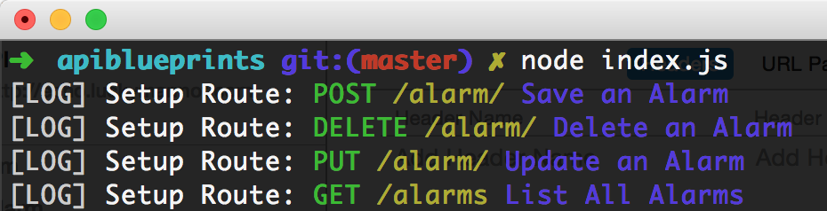

# API Blueprint, Hercule, + Drakov 

Design, documentation and mock data fo API development

## Requirements

- [nodeJS](https://nodejs.org/)
- __(optional)__ [Atom IDE - for API Blueprint editing and preview](https://atom.io/)
- __(optional)__ Some Atom API Blueprint Packages:
    - [language-api-blueprint Atom package](language-api-blueprint)
    - [api-blueprint-preview](https://atom.io/packages/api-blueprint-preview)
    - [apiary-highlighter](https://atom.io/packages/apiary-highlighter)
- __(optional)__ A REST client which can import API Blueprint files. [Paw](https://luckymarmot.com/paw) is a great client but not free. Postman (free) also has a [Blueprint tool](https://github.com/thecopy/apiary2postman).  You can also create a free account on https://apiary.io/ and edit Blueprint files and test them there.

__NOTE: The IntelliJ IDEA Blueprint Plugin does not work.__

## Install

- Install nodeJS
- __(optional)__ Install Blueprint editor and preview IDE
- __(optional)__ Install Atom API Blueprint Packages
- __(optional)__ Install REST client
- Install grunt-cli and aglio globally:

                  $ npm install grunt-cli aglio -g

- Fork and clone repo
- Navigate into app directory and install node modules:

                  $ npm install

## Create API Spec Documentation

- Documentation follows the [API Blueprint Format](https://github.com/apiaryio/api-blueprint).
- To allow the separation of requests, responses, and schemas as separate json files as well as resources as separate blue print files, [hercule](https://github.com/jamesramsay/hercule) is used.
- The structure of the spec should be as follows, i.e. for the alarm API:

                  ├── alarm
                  │   ├── alarm.apib
                  │   └── includes
                  │       ├── alarm-errors.json
                  │       ├── alarm-request.json
                  │       ├── alarm-response.json
                  │       ├── alarm-schema.json
                  │       ├── alarm.md
                  │       └── alarms.md

## Compile Blueprint and create documentation
- Run grunt command to build compiled API Blueprint file and HTML documentation making sure to include the API name you included in the api directory, i.e. if the **API directory** and **.apib** was named `alarm` the command to run would be:

                  $ grunt build:alarm

## Run mock and documentation server
                  $ node index.js

The mock and documentation server used is [drakov](https://github.com/Aconex/drakov).

The server will be running on http://localhost:4007.

API Documentation will be on http://localhost:4007.

The API routes as defined in the documentation will be shown in the console after the server has been started, i.e.

